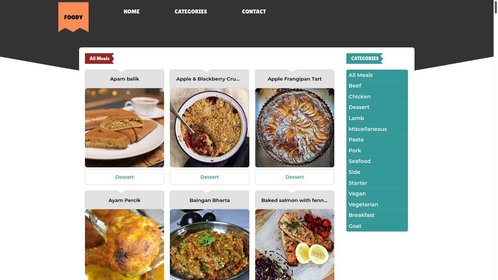

# Foody

## About the Project

The project uses react components and redux store to display a list of meals fetched from [TheMealDB](https://www.themealdb.com/api.php) API with the following features:

- Fetch list of meals and store using a redux store.
- Displays all meals fetched from the API.
- Filters and displays meals based on available categories.
- Displays further details about each meal on meal page.
- Routing between main page and meal page using react router (SPA).

## Table of Contents

- [About the Project](#about-the-project)
- [Built With](#built-with)
- [Live Demo](#live-demo)
- [Prerequisite](#prerequisite)
- [How to use](#how-to-use)
- [Authors](#authors)
- [Contributing](#contributing)
- [Show your support](#show-your-support)
- [License](#license)
- [Acknowledgements](#acknowledgements)

## Built With

- [Node.js](https://nodejs.org/en/)
- [React.js](https://reactjs.org/)
- [React-DOM](https://reactjs.org/docs/react-dom.html)
- [React-Router]()
- [Create-React-App](https://github.com/facebook/create-react-app)
- [React-Redux]()
- [Redux](https://redux.js.org/)
- [npm](https://www.npmjs.com/)
- [CSS]()
- [ES6]()

## Live Demo

[Live Demo Link](https://foody--react-redux.herokuapp.com/)

## Prerequisite

- [Node](https://nodejs.org/)

## How to use

### Locally

- Open a command line and navigate to a directory you want to locally host the project.
- Run `git@github.com:bini-i/Foody-React-Redux.git` to clone the project to your computer.
- Run `npm install` to install all dependencies.
- Run `npm start` to locally start and serve the react application.
- Navigate to `localhost:3000` in your browser to open the applcation.

## Authors

👤 **Binyam Hailemeskel**

- GitHub: [@bini-i](https://github.com/bini-i)
- Twitter: [@binyamshewa](https://twitter.com/binyamshewa)
- LinkedIn: [binyam hailemeskel](https://www.linkedin.com/in/bini-i/)

## Contributing

Contributions, issues, and feature requests are welcome!
Feel free to check the [issues page](../../issues).

1. Fork the Project
2. Create your Feature Branch (`git checkout -b feature/AmazingFeature`)
3. Commit your Changes (`git commit -m 'Add some AmazingFeature'`)
4. Push to the Branch (`git push origin feature/AmazingFeature`)
5. Open a Pull Request

## Show your support

Give a ⭐️ if you like this project!

## License

This project is [MIT](./LICENSE) licensed.

## Acknowledgements

- Design idea by [Denys Chagaida on Behance](https://www.behance.net/chagaida)
- [Microverse](https://www.microverse.org/)
- [The odin project](https://theodinproject.com)
- [freeCodeCamp](https://www.freecodecamp.org/learn/)
- [React tutorial](https://reactjs.org/tutorial/tutorial.html)
- [MDN Web docs](https://developer.mozilla.org/)
